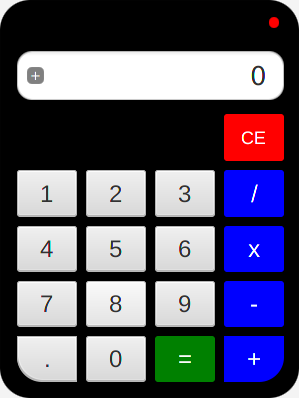

# Calculadora realizada en JavaFX
## José Ramón Jiménez Reyes

Implementación de una calculadora básica cuya interfaz ha sido realizada en JavaFX.

Para que os sirva de ejemplo he utilizado JXML para el diseño de la interfaz y ésta misma la personalizado utilizando CSS.

Espero os sea de ayuda.

